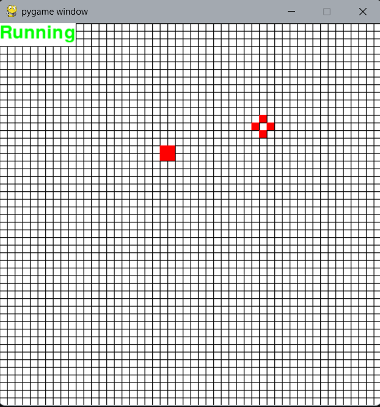
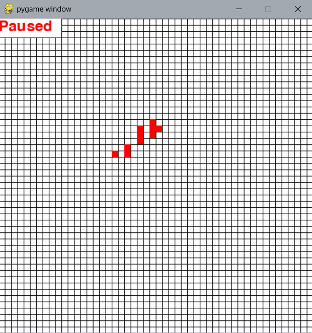
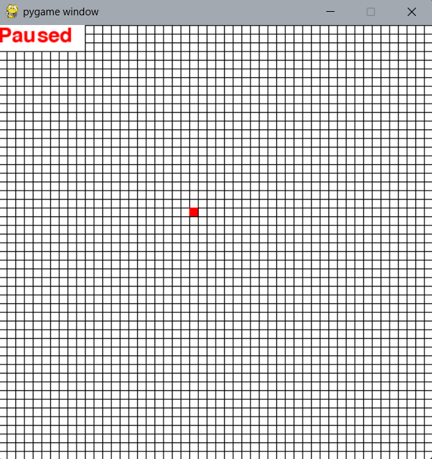

# Conway's Game of Life - Report

## Introduction

Conway's Game of Life is a cellular automaton devised by John Conway. It is a zero-player game where the evolution of a grid of cells is determined solely by its initial state, without any further input. Despite its simple rules, the simulation can produce surprisingly complex and varied behaviors.

## How the Game of Life Works

The simulation consists of a grid where each cell is either **alive** or **dead**. The grid evolves over a series of discrete time steps (generations) according to these rules:

1. **Underpopulation:**  
    A live cell with fewer than 2 live neighbors dies.

2. **Survival:**  
    A live cell with 2 or 3 live neighbors remains alive.

3. **Overpopulation:**  
    A live cell with more than 3 live neighbors dies.

4. **Reproduction:**  
    A dead cell with exactly 3 live neighbors becomes a live cell.

**Important:** All cells are updated simultaneously, meaning that the new state of each cell is determined based on the previous generation's configuration.

## Overview of the Code

The provided Python code uses Pygame for visualization and NumPy for numerical operations. Below is an explanation of the main components:

### `Cell` Class

- **Purpose:**  
    Represents an individual cell in the grid.
    
- **Attributes:**
    - `position`: A NumPy array storing the (x, y) position of the cell.
    - `alive`: A boolean indicating whether the cell is alive.
    - `display`: The Pygame surface used to draw the cell.
    - `_size`: The pixel size of the cell.
    
- **Methods:**
    - `update(neighbors)`: Updates the cell's state based on the number of live neighbors using the Game of Life rules.
    - `draw()`: Draws a red rectangle on the display if the cell is alive.

### `GameOfLife` Class

- **Purpose:**  
    Manages the grid of cells, handles updates, drawing, and user interactions.
    
- **Key Components:**

    - **Grid Initialization:**  
        The grid is created as a 2D list of `Cell` objects. An optional configuration can be provided to set an initial state.
        
    - **Update Method:**  
        The `update()` method computes the next generation of cell states. To ensure that every cell's update is based on the same previous state, the new state for each cell is stored in a temporary 2D list (`new_states`). Only after computing all new states is the grid updated.

        ```python
            new_states = [[False for _ in range(self.width)] for _ in range(self.height)]
            for y in range(self.height):
                for x in range(self.width):
                    neighbors = 0
                    for i in range(-1, 2):
                        for j in range(-1, 2):
                            if i == 0 and j == 0:
                                continue
                            if 0 <= y + i < self.height and 0 <= x + j < self.width:
                                neighbors += self.grid[y + i][x + j].alive

                    if self.grid[y][x].alive:
                        new_states[y][x] = not (neighbors < 2 or neighbors > 3)
                    else:
                        new_states[y][x] = (neighbors == 3)

            for y in range(self.height):
                for x in range(self.width):
                    self.grid[y][x].alive = new_states[y][x]
        ```

    - **Draw Method:**  
        The `draw()` method is responsible for rendering the grid lines, drawing the cells, and displaying the current state (paused or running).

    - **Game Loop (`run` Method):**  
        The `run()` method contains the main loop that:
        - Handles user inputs (e.g., pausing the simulation, clearing the grid, toggling cell states with mouse clicks).
        - Updates the grid based on the temporary state.
        - Draws the updated grid on the Pygame display.
        
### `Configurations` Class

- **Purpose:**  
    Provides preset configurations to initialize the grid with specific patterns.
    
- **Examples:**
    - **Block Pattern:**  
        A stable configuration where a 2x2 block of live cells remains unchanged through generations.
    - **Blinker Pattern:**  
        A simple oscillator that alternates between a horizontal and vertical line.

## Example Patterns

Below are images illustrating different outcomes in the simulation:

### Stable Pattern
A **stable pattern** remains unchanged from one generation to the next.



### Infinite Growth
Certain configurations can lead to **infinite growth**, where the pattern expands indefinitely over time.



### Death Pattern
Some configurations quickly evolve to a state where **all cells die**.

